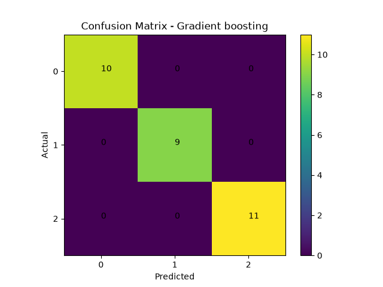

## Gradient Boosting classification from scratch

This project implements Gradient boosting classification from scratch without relying on machine learning libraries for the core algorithm.
The implementation is validated by comparing its performance with scikit-learn's `GradientBoostingClassifier` on the iris dataset.

### Features 

* Gradient boosting classification implemented from scratch.
* Gini impurity calculation
* Threshold generation
* Best feature and threshold selection
* Data splitting
* Recursive tree construction
* Pure-node detection
* Majority-class prediction
* max_depth for controlling tree growth
* classes length intial prediction matrix.
* one hot coding
* soft max
* residual 
* tree prediction
* prediction updation
* store trees
* use the trees to predict for unseen data.
* Model evalution, comparison with scikit-learn
* confusion Matrix plot

### Dataset

load_iris

Source:

sciki-learn datasets

### Algorithm

Gradient Boosting Classification predicts target class by continuesly creating trees with correction of previous tree.

The process continues until it given number of trees reached.

### Prediction

```text
Fm(x) = Fm-1(x) + ηTm(x)
```
* Fm−1(x) = previous ensemble prediction
* Tm(x) = new tree's prediction
* η = learning rate

### SoftMax
```text
pk = e^zk / ∑kj=1 e^zj
```
* zk = the model's score for class
* e^zk = exponential of that score
* K = number of class
* pk = probability of assigned to class k.

### gini impurity
```text
gini = 1 - ∑ pi^2
```

### weighted gini
```text
Weighted Gini =
(n_left / n_total) × Gini_left
+
(n_right / n_total) × Gini_right
```

### Implementation

* Loaded the iris dataset
* split the dataset into training and testing data.
* Generated candidate thresholds for each feature.
* split the training dat using candidat thresholds.
* Calculated gini impurity for each resulting group.
* Calculated weighted gini for each candidate split.
* Selected the split with the lowest weighted gini.
* Recursively constructed the decision tree.
* Used the mean target value as the prediction at leaf nodes.
* Added maximum depth.
* created intial prediction class matrix with zeros.
* make one hot coding for y train data.
* calculated residuals for prediction and actual for training data.
* make tree predictions using residuals.
* update the new tree prediction.
* collect all the correction trees.
* use those trees to predict for x test tree predictions.
* update the predictions
* compare it predictions with actual y test.
* evaluted the model with MSE,MAE,RMSE,R2
* Compared manual implementation with scikit-learn's `GradientBoostingClassifier`.

### Results

### from scratch

```text
Accuracy: 100.0
confusion Matrix: 
[[10  0  0]
 [ 0  9  0]
 [ 0  0 11]]
TP: 11 TN: 19 FP: 0 FN: 0
Precision: 1.0
Recall: 1.0
F1: 1.0
```

### Scikit-learn

```text
scikit Accuracy: 100.0
Confusion Metrix: 
[[10  0  0]
 [ 0  9  0]
 [ 0  0 11]]
Precision: 1.0
Recall: 1.0
F1 Score: 1.0
```

### Visualizations

### confusion matrix




## Folder Structure

```text
Gradient_boosting_Regression/
│
├── plots/
│   ├── confusion_matrix.png
│
├── from_scratch.py
├── sklearn_model.py
├── visualization.py
└── README.md
```

### What I learn

* Implemented gradient boosting from scratch
* Learned how gradient boosting make predictions for classes.
* Learned difference between regression and classification.
* Learned why one hot coding useful in multi class datasets.
* Learned how softmax useful in classifications.
* Learned how to evaluated the classification model.
* Learned to get higher effieciency dataset also should be good with algorithm.


